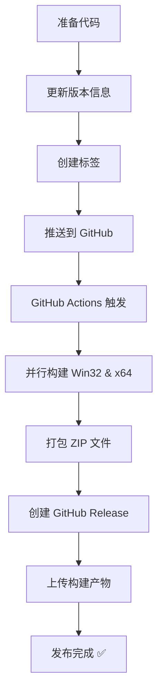

# 如何发布 CrystalDiskInfo 便携版 / How to Release CrystalDiskInfo Portable

## 🚀 快速开始 / Quick Start

### 最简单的方法 / Easiest Method

```bash
# 创建并推送版本标签
./scripts/create-release-tag.sh 9.0.0-RC2
```

这个脚本会：
- ✅ 创建 Git 标签
- ✅ 推送到 GitHub
- ✅ 自动触发构建和发布

---

## 📋 详细步骤 / Detailed Steps

### 步骤 1: 准备代码 / Step 1: Prepare Code

确保所有更改都已提交：

```bash
git status
git add .
git commit -m "Update version to 9.0.0-RC2"
git push origin feat/windows-portable-win10-1803-release
```

### 步骤 2: 更新版本信息 / Step 2: Update Version Info

编辑 `stdafx.h` 文件：

```cpp
#define PRODUCT_VERSION       L"9.0.0 RC2"
#define PRODUCT_RELEASE       L"2024/01/15"  // 更新为发布日期
#define PRODUCT_COPY_YEAR     L"2008-2024"   // 更新年份
```

提交更改：

```bash
git commit -am "chore: Update version to 9.0.0 RC2"
git push
```

### 步骤 3: 创建发布 / Step 3: Create Release

#### 选项 A: 使用脚本（推荐）/ Option A: Use Script (Recommended)

```bash
# 正式发布
./scripts/create-release-tag.sh 9.0.0-RC2

# 测试发布（之后可删除）
./scripts/create-release-tag.sh 9.0.0-test --test
```

#### 选项 B: 手动创建标签 / Option B: Manual Tag Creation

```bash
# 创建标签
git tag -a v9.0.0-RC2 -m "Release version 9.0.0 RC2"

# 推送标签
git push origin v9.0.0-RC2
```

#### 选项 C: 使用 GitHub 网页界面 / Option C: Use GitHub Web UI

1. 访问仓库的 **Actions** 页面
2. 选择 **"Build and Release Windows Portable"** 工作流
3. 点击 **"Run workflow"**
4. 输入版本号: `9.0.0-RC2`
5. 点击 **"Run workflow"** 按钮

### 步骤 4: 监控构建 / Step 4: Monitor Build

```bash
# 使用 GitHub CLI 监控
gh run watch

# 或查看运行列表
gh run list --workflow=build-release.yml

# 或在浏览器中查看
open https://github.com/wakusei0413/CrystalDiskInfo/actions
```

### 步骤 5: 验证发布 / Step 5: Verify Release

1. 访问 [Releases 页面](https://github.com/wakusei0413/CrystalDiskInfo/releases)
2. 找到新创建的发布
3. 检查包含的文件：
   - ✅ `CrystalDiskInfo-Win32-Release-portable.zip`
   - ✅ `CrystalDiskInfo-x64-Release-portable.zip`

### 步骤 6: 测试下载 / Step 6: Test Download

```bash
# 下载 x64 版本
wget https://github.com/wakusei0413/CrystalDiskInfo/releases/download/v9.0.0-RC2/CrystalDiskInfo-x64-Release-portable.zip

# 解压并测试
unzip CrystalDiskInfo-x64-Release-portable.zip -d test-release
```

在 Windows 机器上：
1. 解压 ZIP 文件
2. 运行 `DiskInfo64.exe` 或 `DiskInfo32.exe`
3. 验证程序正常运行
4. 检查版本号是否正确

---

## 🔄 发布流程图 / Release Flow



---

## 📦 发布内容 / Release Contents

每个发布包含以下文件：

### Win32 版本
- **文件**: `CrystalDiskInfo-Win32-Release-portable.zip`
- **大小**: 约 2-3 MB
- **包含**:
  - `DiskInfo32.exe`
  - 语言文件
  - 资源文件
  - 辅助库
  - 许可证文档

### x64 版本
- **文件**: `CrystalDiskInfo-x64-Release-portable.zip`
- **大小**: 约 2-3 MB
- **包含**:
  - `DiskInfo64.exe`
  - 语言文件
  - 资源文件
  - 辅助库
  - 许可证文档

---

## ⚙️ 高级选项 / Advanced Options

### 本地构建 / Local Build

在 Windows 机器上本地构建：

```batch
scripts\build-local.bat
```

手动打包：

```powershell
.\scripts\package-portable.ps1 -Configuration Release -Platform x64
```

### 包含 CdiResource / Include CdiResource

如果要在发布中包含完整的主题和语言资源：

```powershell
.\scripts\package-portable.ps1 `
    -Configuration Release `
    -Platform x64 `
    -ResourceOverride "C:\Path\To\CdiResource"
```

### 自定义输出目录 / Custom Output Directory

```powershell
.\scripts\package-portable.ps1 `
    -Configuration Release `
    -Platform x64 `
    -OutputRoot "C:\CustomOutput"
```

---

## ❓ 常见问题 / FAQ

### Q1: 构建失败怎么办？

**检查 Actions 日志**:
1. 进入 Actions 页面
2. 点击失败的运行
3. 查看详细日志

**常见原因**:
- 权限不足：检查仓库的 Actions 权限设置
- 编译错误：检查代码是否有语法错误
- 依赖缺失：确保项目文件完整

### Q2: 如何删除错误的发布？

```bash
# 删除 GitHub Release
# 1. 在网页上删除 Release

# 2. 删除本地标签
git tag -d v9.0.0-RC2

# 3. 删除远程标签
git push origin :refs/tags/v9.0.0-RC2
```

### Q3: 可以修改发布说明吗？

可以！在 GitHub Releases 页面：
1. 找到对应的发布
2. 点击 **"Edit"** 按钮
3. 修改标题和说明
4. 点击 **"Update release"**

### Q4: 构建需要多长时间？

通常情况：
- Win32 构建: 3-5 分钟
- x64 构建: 3-5 分钟
- 打包和发布: 1-2 分钟
- **总计**: 约 5-10 分钟

### Q5: 支持哪些 Windows 版本？

- ✅ Windows 10 Version 1803 及更高版本
- ✅ Windows 11
- ⚠️ 理论上支持 Windows XP+，但推荐 Win10 1803+

---

## 📚 相关文档 / Related Documentation

- [QUICK_RELEASE.md](QUICK_RELEASE.md) - 快速发布参考（中英双语）
- [BUILD_RELEASE.md](BUILD_RELEASE.md) - 详细构建文档
- [IMPLEMENTATION_SUMMARY.md](IMPLEMENTATION_SUMMARY.md) - 实现总结
- [README.md](README.md) - 项目概览

---

## 🛠️ 故障排除 / Troubleshooting

### 问题: Actions 权限错误

**错误信息**: `Resource not accessible by integration`

**解决方案**:
1. 进入仓库 **Settings** → **Actions** → **General**
2. 在 **Workflow permissions** 下选择:
   - ✅ **Read and write permissions**
3. 保存更改

### 问题: 找不到 MSBuild

**错误信息**: `MSBuild not found`

**解决方案**:
- GitHub Actions 使用 `windows-2019` runner，已预装 VS 2019
- 如果需要 VS 2022，修改 workflow 为 `windows-latest`

### 问题: 打包脚本找不到可执行文件

**错误信息**: `Unable to locate 'DiskInfo32.exe'`

**解决方案**:
1. 检查构建是否成功
2. 查看构建日志中的输出路径
3. 脚本会搜索 `..\Rugenia\` 目录

---

## ✅ 发布前检查清单 / Pre-Release Checklist

- [ ] 更新了版本号 (`stdafx.h`)
- [ ] 更新了发布日期 (`stdafx.h`)
- [ ] 更新了版权年份 (`stdafx.h`)
- [ ] 所有代码已提交并推送
- [ ] 运行了本地测试（如果可能）
- [ ] 准备好发布说明
- [ ] 确认标签名称正确
- [ ] 确认 Actions 权限已设置

---

## 📞 获取帮助 / Get Help

如果遇到问题：

1. 查看 [Issues 页面](https://github.com/wakusei0413/CrystalDiskInfo/issues)
2. 查看 Actions 运行日志
3. 查看相关文档
4. 创建新的 Issue

---

**祝发布顺利！🎉 / Happy Releasing! 🎉**
